# 🎬 Movies App

Welcome to *Movies App*!  
An Android application for browsing, searching, and managing your favorite movies with a modern and clean user experience.


---

## 1. 📋 Overview

- **Project Name**: App-Movie
- **Type**: Android Mobile Application
- **Purpose**: Provide a responsive and modern interface for exploring trending or now-playing movies
- **Architecture**: MVVM (Model-View-ViewModel)
- **Backend**: Api


---

## 2. 🧰 Technologies Used

| Technology                          | Description                                                        |
|-------------------------------------|--------------------------------------------------------------------|
| Kotlin                              | Primary language for Android development                           |
| MVVM Architecture                   | Structured separation of UI and business logic                     |
| Retrofit                            | RESTful API calls to backend services                              |
| Gson / Moshi                        | JSON parsing libraries used with Retrofit                          |
| Hilt                                | Dependency Injection framework                                     |
| Coroutines                          | For managing asynchronous operations efficiently                   |
| Flow / StateFlow / MutableStateFlow | Reactive UI state management in ViewModel                          |
| SharedFlow                          | One-time UI events (e.g. navigation, toast)                        |
| Loading State Management            | Handled via `sealed class` and `StateFlow` to show/hide loading UI |
| ViewModel                           | Lifecycle-aware UI data management                                 |
| DataStore                           | Modern key-value storage replacing SharedPreferences               |
| Navigation Component                | Navigation graph, deep linking, and Safe Args support              |
| Glide                               | Image loading and caching library                                  |
| View Binding                        | Type-safe access to views without findViewById                     |
| ExoPlayer / YouTubePlayer           | For embedding and playing movie trailers or videos                 |
| Api Movies                          | Movie data source: https://www.themoviedb.org/                     |
| Api User                            | Fake user data API: https://fakeapi.platzi.com/en                  |


---

## 3. 🔧 Installation Guide

*Requirements:*
* Android Studio Giraffe or later
* JDK 21 or above
* Stable Internet connection

**Steps:**
```sh
# Step 1: Clone the repository
git clone https://github.com/nguyendacson/Movies.git
cd Movies

# Step 2: Open in Android Studio

# Step 3: Sync Gradle and run the app
```


---

## 4. 📱 App Features & Screens

| Screen         | Description                                                                            |
|----------------|----------------------------------------------------------------------------------------|
| 🚀 Welcome     | Initial screen with options to log in or sign up                                       |
| 🔐 Login       | Allows existing users to log into their accounts                                       |
| 📝 Signup      | Allows new users to create an account                                                  |
| 🏠 Home        | Displays featured and popular movies                                                   |
| 🔥 Trending    | Shows currently trending movies                                                        |
| 🎬 Now Playing | Lists movies currently playing in theaters                                             |
| ⭐ Watch List   | Allows users to view, add, or remove movies from their personal favorites              |
| 🔍 Search      | Allows users to search movies by keyword                                               |
| 📖 Detail      | Displays detailed information about a selected movie (Nav_Cast, Nav_Review, Nav_About) |
| 🧰 Filter      | Lets users sort and filter movies by genre, release date, or rating                    |
| 👤 Profile     | Displays user account and preferences                                                  |
| 🎞️ Player     | Allows users to watch trailers or full movies directly within the app                  |


___

## 🧰 Filter Screen – Reusable Sorting & Filtering

The **Filter** screen allows users to refine and sort movie lists based on their preferences.  
It is designed as a **reusable component** and ensures a consistent filtering experience across the app.

---

### 🔄 Applicable Screens

The Filter screen can be accessed from the following screens when click "all movies" on screens:

- **🔥 Trending**
- **🎬 Now Playing**
- **🔍 Search**


---

### 🔍 Supported Filters

- **Sort by**:
    - Ascending
    - Descending

- **Filter by**:
    - Vote Average
    - Year
    - Vote Count


---

## 5. ▶️ How to Use

* Launch the app and explore trending or now-playing movies
* Tap any movie to view detailed information
* Use the search feature to find specific movies
* Add favorite movies to your personal Watch List
* Navigate to your Profile to manage personal information


---

## 6. 📌 Roadmap

| Feature                     | Status         |
|-----------------------------|----------------|
| Google Sign-In Integration  | 🔄 In Progress |
| Dark Mode Support           | ⏳ Planned      |
| Unit Testing Implementation | ⏳ Planned      |
| Play Store Deployment       | ⏳ Planned      |


---

## 7. 👨‍💻 Project Members & Acknowledgments

* *Developer*: Nguyễn Đắc Sơn
* *Email*: dacson1822003@gmail.com
* *Acknowledgment*: Special thanks to my internship mentors and reviewers for their valuable support and guidance throughout the project.


---

## 🖼️ Screenshots

### 🚀 Welcome Screen
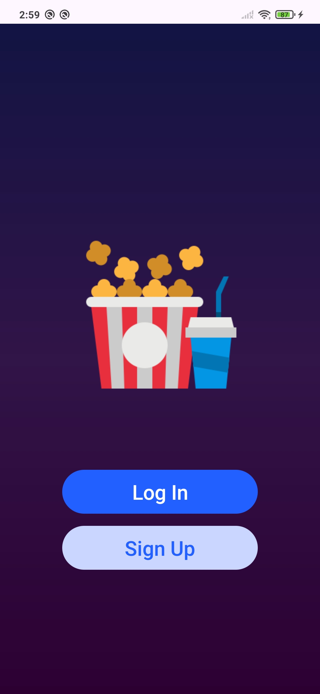

### 🔐 Login Screen
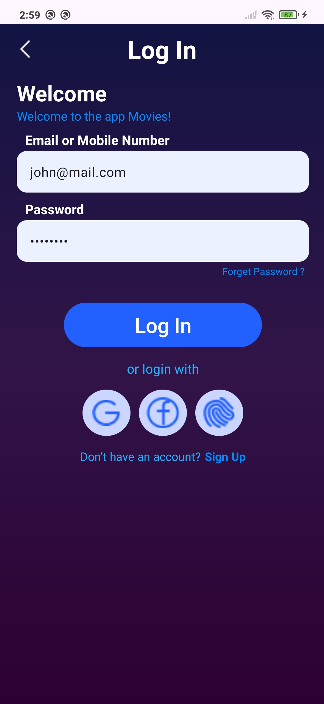

### 📝 Signup Screen
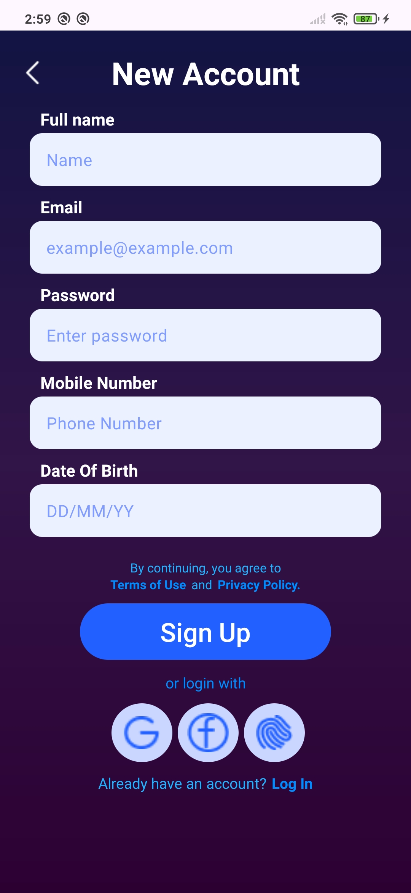

### 🏠 Home Screen
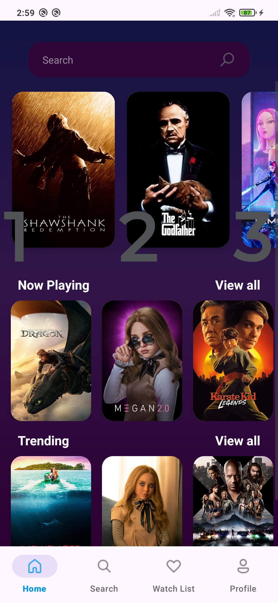

### 🔍 Search Screen
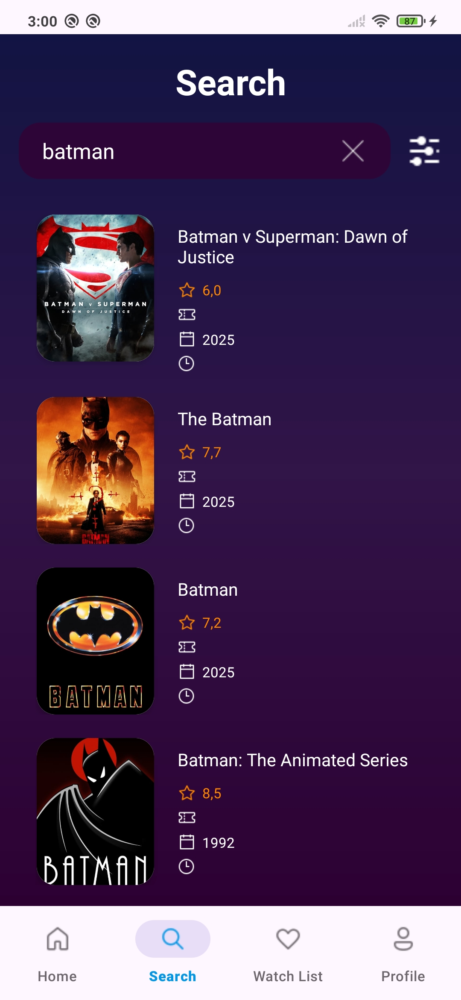

### 🧰 Search Screen Filter


### 🔥 Trending Screen
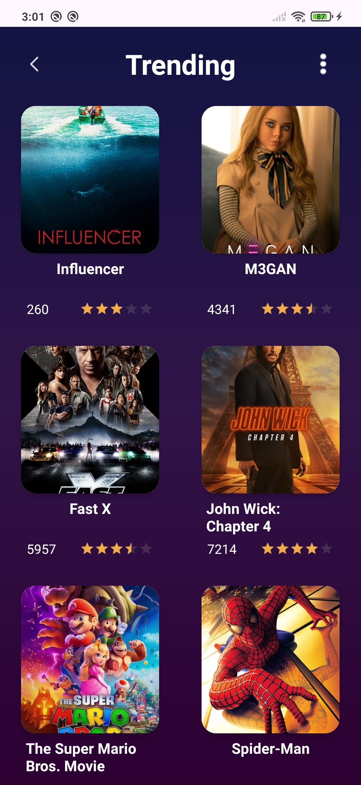

### 🧰 Trending Screen Filter
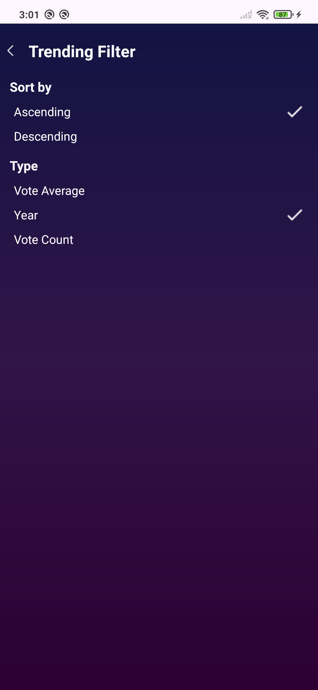

### 🎬 Now Playing Screen
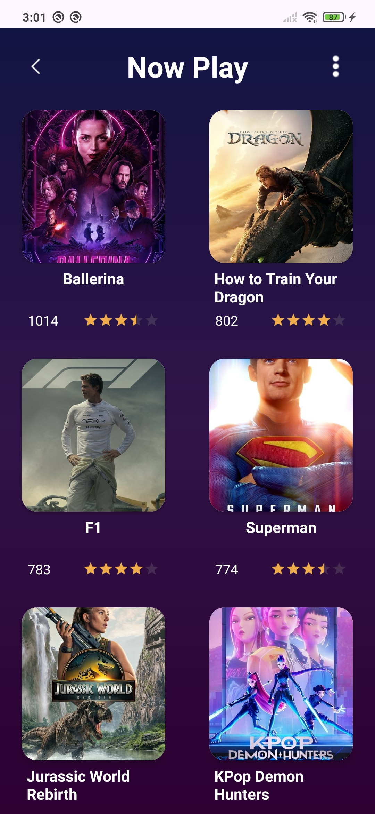

### 🧰 Now Playing Screen Filter


### ⭐ Watch List Screen
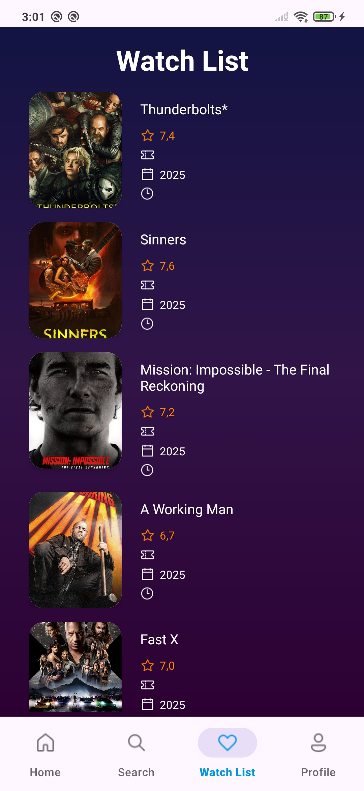

### 📖 Detail Screen About
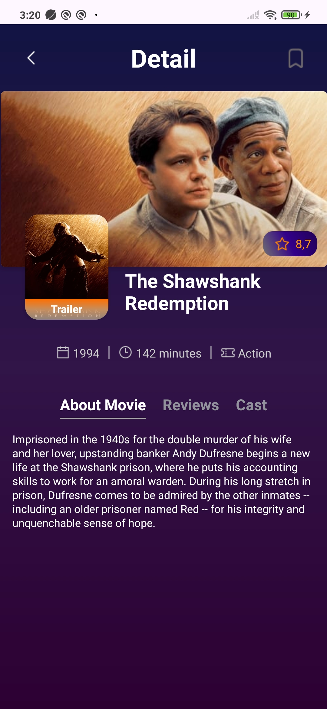

### 📖 Detail Screen Cast
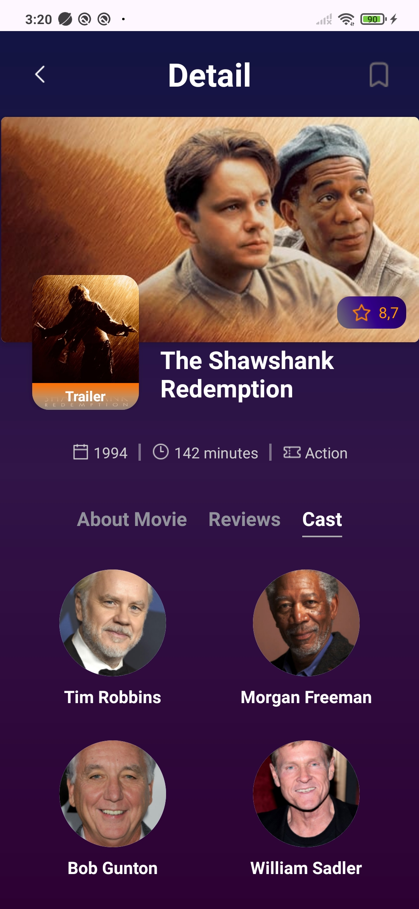

### 📖 Detail Screen Review
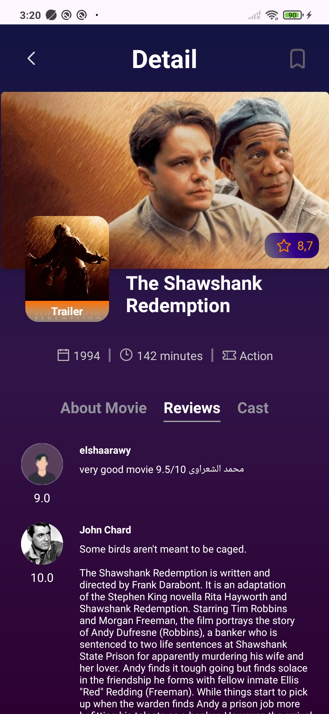

### 👤 Profile Screen
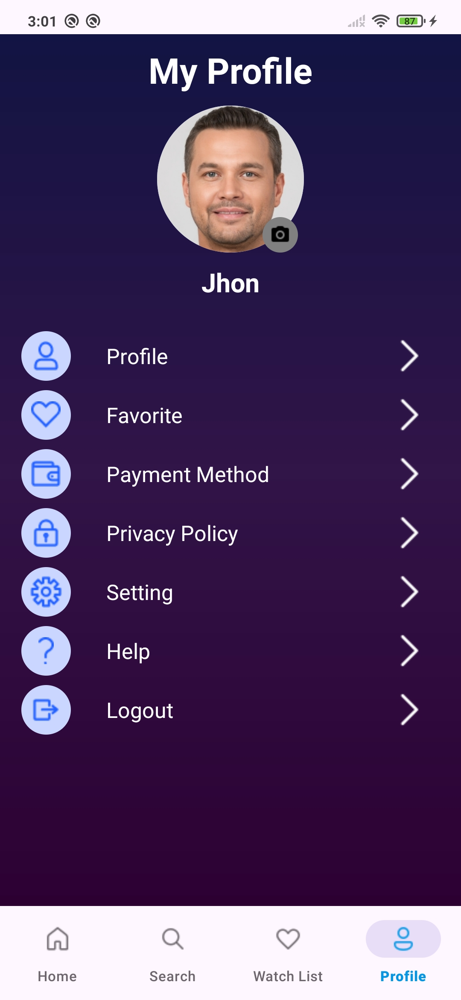

### 👤 Profile Screen Logout
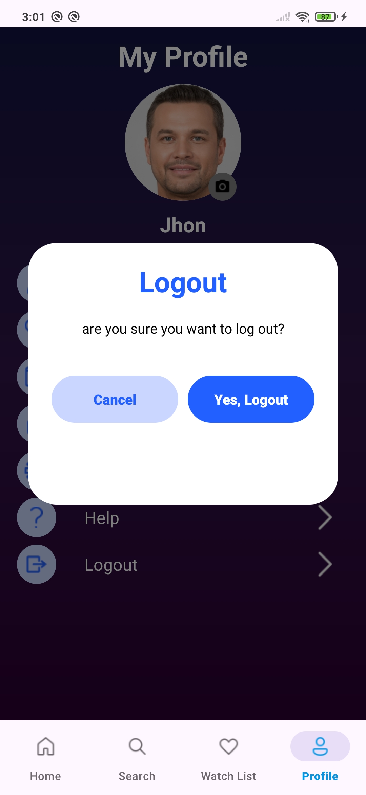

### ️ 🎞️ Player
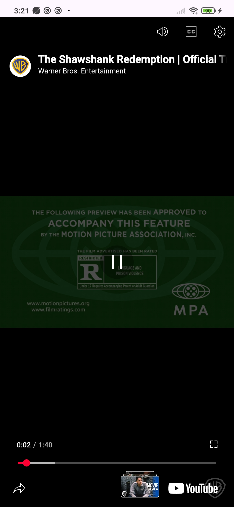

### ️ 🎞️ Player
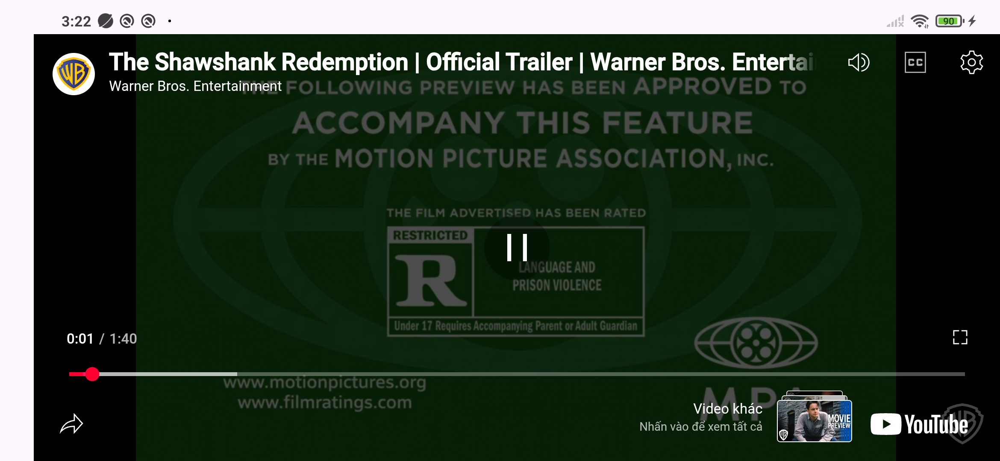
